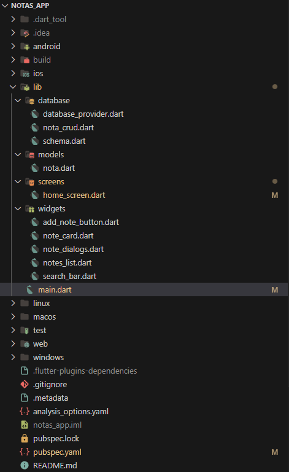

## notas_app

Una aplicación Flutter sencilla para tomar y gestionar notas.

## Características

- Crear, editar y eliminar notas
- Organizar notas con títulos y contenido
- Interfaz adaptable para dispositivos móviles

## Primeros pasos

1. Clona el repositorio:
    ```bash
    git clone https://github.com/yourusername/notas_app.git
    ```
2. Navega al directorio del proyecto:
    ```bash
    cd notas_app
    ```
3. Instala las dependencias:
    ```bash
    flutter pub get
    ```
4. Ejecuta la aplicación:
    ```bash
    flutter run
    ```

## Capturas de pantalla

Estrutura Contenido



Vista Previa


## Contribuciones

¡Las contribuciones son bienvenidas! Por favor abre issues o envía pull requests.

## Licencia

Este proyecto está licenciado bajo la Licencia MIT.
